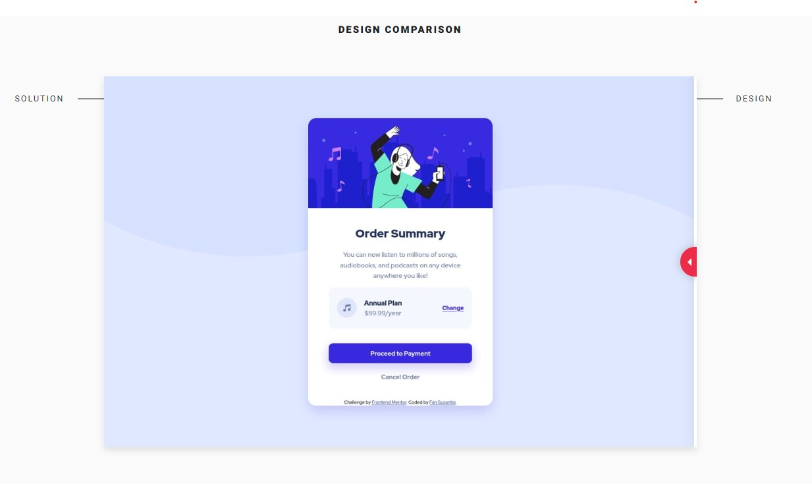

# Frontend Mentor - Order summary card solution

This is a solution to the [Order summary card challenge on Frontend Mentor](https://www.frontendmentor.io/challenges/order-summary-component-QlPmajDUj). Frontend Mentor challenges help you improve your coding skills by building realistic projects.

## Table of contents

- [Overview](#overview)
  - [The challenge](#the-challenge)
  - [Screenshot](#screenshot)
  - [Links](#links)
- [My process](#my-process)
  - [Built with](#built-with)
  - [What I learned](#what-i-learned)
  - [Continued development](#continued-development)
- [Author](#author)

## Overview

### The challenge

Users should be able to:

- See hover states for interactive elements

### Screenshot



### Links

- Solution URL: [https://www.frontendmentor.io/solutions/order-summary-card-using-bootstrap-css-VOmx8iVmnm](https://www.frontendmentor.io/solutions/order-summary-card-using-bootstrap-css-VOmx8iVmnm)
- Live Site URL: [https://vibrant-shannon-aac3d2.netlify.app/#](https://vibrant-shannon-aac3d2.netlify.app/#)

## My process

1. Initialize project as a public repository on [GitHub](https://github.com/).
2. Configure repository to publish code to a web address on Netlify.
3. Look through the designs to start planning out how to tackle the project.
4. Before adding any styles, structure content with HTML.
5. Write out the base styles for project, including general content styles, such as `font-family` and `font-size`.
6. Start adding styles to the top of the page and work down.

### Built with

- Mobile-first workflow
- Semantic HTML5 markup
- CSS custom properties
- Bootstrap

### What I learned

Use this section to recap over some of your major learnings while working through this project. Writing these out and providing code samples of areas you want to highlight is a great way to reinforce your own knowledge.

To see how you can add code snippets, see below:

I learned that HTML5 landmarks are used to improve navigation

```html
<main class="container vertical-center"></main>
```

I learned that you can define colours by name in css

```css
:root {
  --pale-blue: hsl(225, 100%, 94%);
  --bright-blue: hsl(245, 75%, 52%);
  --very-pale-blue: hsl(225, 100%, 98%);
  --desaturated-blue: hsl(224, 23%, 55%);
  --dark-blue: hsl(223, 47%, 23%);
}

.card-title {
  color: var(--dark-blue);
}
```

I learned about using @media rules

```css
@media (min-width: 375px) {
}
```

### Continued development

I'd like to continue to understand

- responsive design and flexbox
- CSS positioning, alignment, display features

## Author

- Website - [Add your name here](https://www.your-site.com)
- Frontend Mentor - [@FanSusantio](https://www.frontendmentor.io/profile/FanSusantio)
